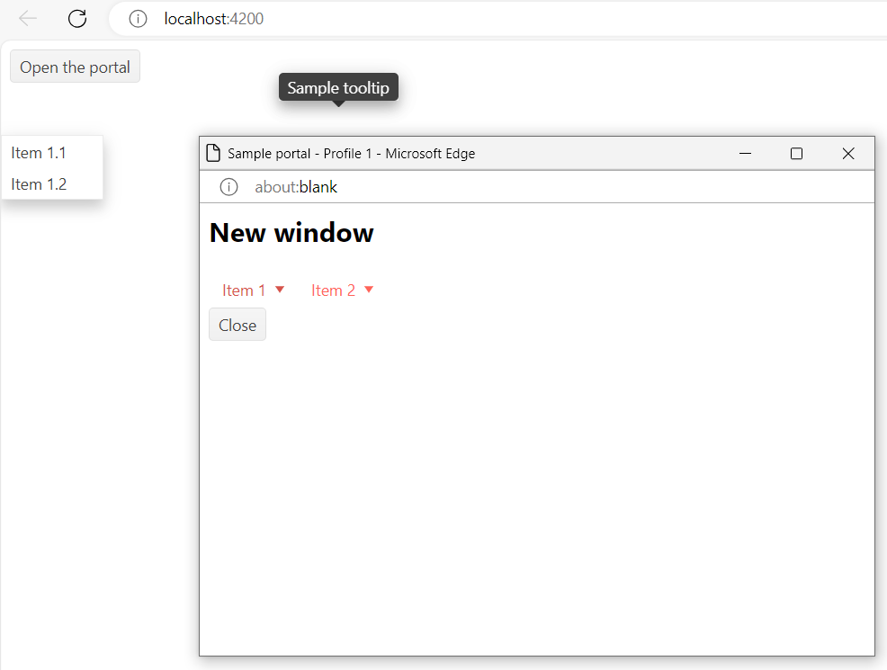

# Kendo UI popup elements issue

This is sample project to show the issue with showing popup elements when using Kendo UI for Angular and CDK Portal.

The popup elements was created and appended to the body element from original window instead of the popup window's body element. 

When hovering on menu or "Close" button, the tooltip, sub menu items was rendered in wrong place.

## Start the application

Run `npm i` to install dependences.
Run `npm run start` for a dev server, then navigate to `http://localhost:4200/`

## Steps to reproduce the issue

Opening the application at `http://localhost:4200/`
On start page, we have a button "Open the portal", hovering on this button, tooltip displayed properly.
Click "Open the portal" button, new window appears.
Hovering on menu in the new window, sub menu items are rendered on the main window instead of the current window which hosts the kendo menu component.
Hovering on "Close" button, tooltip is rendered on the main window instead od the current window which hosts the kendo button.

## Screenshots

## Expect behavior

Sub menus, tooltip,.. (popup elements) should be rendered and appended to closest 'body' element of the kendo menus, kendo buttons.
